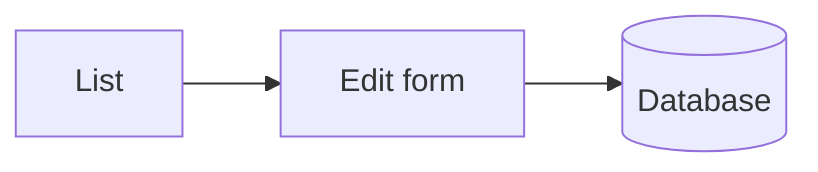

# Writing Knowledge Base Articles

This page is about the **mechanics**: how a file becomes an article, what the panel does with each
piece of metadata, and how to check the result. What to write about is your decision; everything
below is what the system actually does with what you wrote.

It describes the bundled `FileDocumentation` — markdown files on disk. A custom implementation
invents its own source format, but the metadata it has to produce (`DocMeta`) and everything that
happens afterwards are the same; see [Knowledge Base](../KnowledgeBase.md) for the subsystem itself.

---

## Where articles live

The directory is named when the implementation is registered:

```ts
adminizer.documentationHandler.register(new FileDocumentation({
    dir: path.resolve(import.meta.dirname, 'documentation'),
    defaultLocale: 'en',   // locale of files without a suffix
    watch: true,           // rescan when a file changes
}));
```

* The directory is scanned **recursively**; only `*.md` files are read.
* Subdirectories are for your own order only — **the id comes from the file name, not from the
  path**. `basics/intro.md` and `advanced/intro.md` are the same document `intro`, and the one
  scanned last wins.
* The scan result is cached in memory. With `watch: true` a change anywhere under `dir` drops the
  cache (200 ms debounce) and the next request rereads the files; without it, restart the app.

## Anatomy of a file

```markdown
---
title: Working with data models
section: Basics
keywords: [models, records, fields]
models: [Test, Example]
urls: [/adminizer/model/:modelResourceName]
accessRightsToken: read-secret-operations-doc
---

# Working with data models

The body of the article, in markdown.
```

Everything between the two `---` lines is metadata; everything after is the article. A file without
a frontmatter block is a valid article too — it just carries no metadata, and its title is taken
from the first `#` heading.

## The id

The id is the file name without `.md` and without the locale suffix; a `id:` key in the frontmatter
overrides it.

It is the **public handle of the article**: it appears in the viewer URL
(`/adminizer/docs/<id>`), in the `#info=<id>` deep link, in links from other articles, and in what
the assistant returns from its skills. Renaming a file changes the id and breaks every link and
bookmark pointing at it.

* Keep it slug-like: lowercase, dashes, no spaces — it ends up in a URL.
* Avoid dots inside the name. A trailing `.xx` is read as a locale suffix, so `notes.io.md` becomes
  document `notes` in locale `io`.

## Frontmatter syntax

The parser is a deliberately small subset — **not** YAML. Supported forms:

| Form | Example |
|---|---|
| `key: value` | `section: Basics` |
| Quoted value | `title: "Orders: the full cycle"` |
| Inline list | `keywords: [models, records]` |
| Dash list | `models:` followed by indented `- Test` lines |

```markdown
---
title: Orders
models:
  - Order
  - OrderLine
---
```

There is no nesting, no multi-line strings, no anchors. A line that is not a `key: value` pair and
not a dash item is ignored, and so is any key the panel does not know — which makes a stray line
silently do nothing rather than break the file.

| Key | Type | What the panel does with it |
|---|---|---|
| `title` | string | Shown in the tree, the article header, the drawer and search results. Falls back to the first `#` heading, then to the id |
| `section` | string | Groups the article in the viewer tree and in the drawer's table of contents |
| `keywords` | list | Filter chips in the viewer, and the keyword map the assistant discovers topics through |
| `models` | list | Binds the article to model resources — **and gates access to it** (see below) |
| `urls` | list | Binds the article to admin pages: the "i" button and the `docs` prop of those pages |
| `accessRightsToken` | string | An **existing** access token required to read this article |
| `id` | string | Overrides the id derived from the file name |
| `locale` | string | Overrides the locale derived from the file name |

## Translations

A translation is a sibling file with a locale suffix: `intro.md` + `intro.ru.md` is one document
`intro` available in `en` and `ru`. The suffix is `xx` or `xx-YY` (`ru`, `pt-BR`).

Not everything is translated per file:

| Translated per file | Taken from the default-locale file |
|---|---|
| `title`, `keywords`, the body | `section`, `models`, `urls`, `accessRightsToken` |

So structural metadata is edited in `intro.md` only — writing `models:` in `intro.ru.md` has no
effect as long as `intro.md` exists.

Which translation a reader gets: the requested locale if it exists, otherwise the default locale,
otherwise whatever the document has. The response says which one it actually served, and the viewer
shows the locale chips only when the document has more than one translation. The requested locale is
the `locale` query parameter, or the reader's own locale, or `translation.defaultLocale` from the
config — in that order.

## Binding an article to a place in the panel

```markdown
urls: [/adminizer/model/:modelResourceName, /adminizer/model/:modelResourceName/edit/:id]
models: [Order]
```

`urls` are Express-style patterns matched against the **full admin path, route prefix included**:

| Pattern | Matches | Does not match |
|---|---|---|
| `/adminizer` | `/adminizer`, `/adminizer/` | `/adminizer/model/Order` |
| `/adminizer/model/:name` | `/adminizer/model/Order` | `/adminizer/model/Order/edit/7` |
| `/adminizer/model/:name/edit/:id` | `/adminizer/model/Order/edit/7` | `/adminizer/model/Order` |

A `:param` matches exactly one path segment; trailing slashes, the query string and the hash are
ignored. Because the route prefix is part of the pattern, articles bound by `urls` follow the
`routePrefix` of the project — bind by `models` when you want that not to matter.

What the binding drives:

* the **"i" button** in the page header — it appears when the current page has at least one bound
  article the reader may open (or when the page is a model page, which always has a schema to show);
* the contextual table of contents in the drawer, and the `docs` shared prop behind it;
* scoped search: the assistant can ask for "documentation of this URL / this model" instead of
  searching everything.

`models` binds *and* gates: an article listing models is only visible to readers who may read at
least one of them.

## Who may read the article

Three checks, in this order:

1. **`read-documentation`** — the base token. Without it the whole knowledge base is invisible.
2. **`accessRightsToken`** — when set, it is required on top. It must name a token that already
   exists; the subsystem never creates tokens from articles, so a token nobody registered leaves the
   article visible to administrators only.
3. **`models`** — when set, the reader needs `read-<Model>-model` for at least one of them.

An article the reader may not open does not exist for them: it is absent from the tree, from search
results and from the keyword map, and a link to it from another article renders as plain text.

A custom per-article token is ordinary host or app code:

```ts
adminizer.accessRightsHelper.registerToken({
    id: 'read-secret-operations-doc',
    name: 'Secret operations doc',
    description: 'Access to the "Secret operations" article',
    department: 'documentation',
});
```

## Links

| Written as | Behaviour |
|---|---|
| `[Models](models-guide)` | Another article, by id. A link when the reader may open it, plain text when not |
| `[Models](models-guide#fields)` | Same, but the anchor is only used to find the article — it opens at the top |
| `[Fields](#fields)` | Anchor inside the current article |
| `[Orders](/adminizer/model/Order)` | Admin page, opened through Inertia without a full reload |
| `[Docs](https://docs.adminizer.org)` | External link, opens in a new tab |
| `` | Image by absolute URL — the documentation directory itself is not served, so relative image paths do not work |

Write the bare id: `models-guide`, not `./models-guide` and not `models-guide.md` — the file name is
not the handle, the id is.

All references of an article are resolved **on the server** in one request when the article opens,
so a link never reveals that an article the reader may not open exists.

Anchors come from the headings: lowercased, every run of characters that are not letters or digits
becomes a dash. `## How a record travels` → `#how-a-record-travels`.

## Diagrams and model schemas

Two fenced blocks are rendered specially.

A diagram — the mermaid library is loaded only when an article actually contains one, and follows
the panel's light/dark theme:

````markdown

````

The structure of a model — fetched through the API when the article is opened, so every reader sees
exactly the fields their own rights allow:

````markdown
```schema
{"model": "Test"}
```
````

A table that is not backed by a model can be written inline instead:

````markdown
```schema
{"title": "Import file", "fields": [
    {"name": "sku", "title": "SKU", "type": "string", "required": true},
    {"name": "price", "title": "Price", "type": "number", "required": false}
]}
```
````

Both degrade gracefully: a diagram that does not parse, invalid JSON, a model that does not exist or
one the reader may not read all fall back to showing the block as plain code.

## Headings and the mini table of contents

The viewer builds a small table of contents from the `##` and `###` headings and shows it when an
article has at least three of them; `#`…`###` also get anchors. Headings inside fenced code blocks
are ignored. In other words: one `#` title, then `##` sections, and long articles get navigation for
free.

The rest is GitHub-flavoured markdown: tables, task lists, strikethrough, block quotes, images and
code fences (with a copy button, and the language shown in the header of the block).

## Checking your work

| Check | How |
|---|---|
| The article is there | Open `{routePrefix}/docs` — the tree is grouped by `section` |
| Search finds it | `{routePrefix}/docs?q=widgets`, or a keyword chip: `?keyword=models` |
| Keywords are right | `GET {routePrefix}/docs/api/keywords` |
| The binding works | Open the bound page and press "i", or `GET {routePrefix}/docs/api/context?url=/adminizer/model/Order` |
| Rights work | Open the panel as a user without the token: the article must be absent, not forbidden |
| The assistant sees it | Ask it to search the documentation, or use `read_documentation` with the id |

With `watch: true` an edit is visible on the next page load. Without it, restart the app.

## When something does not show up

| Symptom | Usual cause |
|---|---|
| The article is missing for everyone | The file is outside `dir`, or is not `*.md`, or the app was not restarted without `watch` |
| The article is missing for one user | They lack `read-documentation`, the `accessRightsToken`, or `read-<Model>-model` for the models it lists |
| It exists but nobody except admins sees it | `accessRightsToken` names a token that was never registered |
| A link renders as plain text | The id is misspelled, written as a path (`./id`, `id.md`), or the target is not readable by that reader |
| The "i" button does not appear | No `urls` pattern matches the real path — check the route prefix and the number of segments |
| A translation is ignored | The suffix is not a locale (`intro.v2.md`), or structural metadata was put in the translation instead of the default-locale file |
| Two articles overwrite each other | Two files share a base name in different subdirectories |
| A `schema` block shows its source | Invalid JSON, a model that does not exist, or no read rights for that model |
