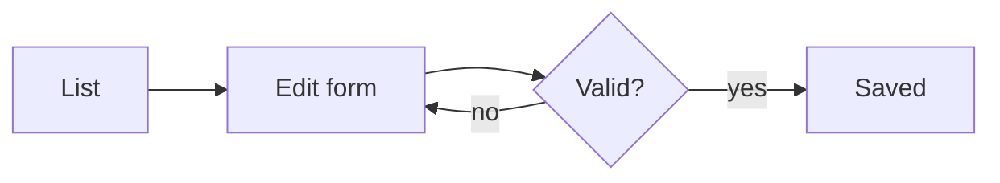

# Working with data models

This document is bound to the `Test` and `Example` models: it is visible only
to users who may read at least one of them, and it shows up in the contextual
documentation of every model list page.

## Lists

The list view shows the records your access rights allow. Filters, saved
filters and column settings live in the toolbar.

## Editing

Records are edited field by field; fields you may not edit are hidden by the
panel itself, so what you see is exactly what you may touch.

## Structure of the Test model

A `schema` block renders the fields of a model resource. The list is built on
the server through `DataAccessor`, so every reader sees exactly the fields
their own rights allow:

```schema
{"model": "Test"}
```

## How a record travels



Back to [getting-started](getting-started).
