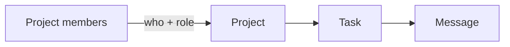

# Project graph

**In one sentence:** you see only the projects you were added to — and the tasks
and messages inside those projects come along automatically.

## What it does

The demo has three models that hang off each other, plus one table that says who
belongs where:

You are added to a project **once**, in *Project members*. After that:

* **Projects** shows your projects only.
* **Tasks** shows the tasks of those projects — even though a task says nothing
  about who may see it.
* **Messages** shows the messages of those tasks — two steps away from the
  project, and still filtered.

The same membership row also carries a **role**: an ordinary group, either
*Project editors* or *Project viewers*. It decides what you may do **in that
project**. So one person can be an editor in one project and a read-only viewer
in another, at the same time, with no extra configuration.

## Why this app is here

Reading about record-level access is not the same as watching it work. This app
gives you something to click:

* It is the **live example** of the `accessGraph` setting — the same
  Project → Task → Message chain the manual describes, with data in it.
* It shows that filtering happens **in the query**, not in the interface. A row
  you may not see is not hidden — it is not there. Opening it by a direct URL
  gives *not found*.
* It shows the **boundaries**: dropdowns offer only your projects, saving into a
  foreign project is refused, and handing out memberships stays an administrator
  job.
* It is packaged as an app, so it can be removed from this demo panel entirely
  without touching anything else.

## Log in and compare

Every demo user has a password equal to their login.

| Login | Apollo | Borealis | What they get |
| --- | --- | --- | --- |
| `user1` | editor | — | Apollo only: 2 tasks, 3 messages, full editing |
| `user2` | viewer | editor | Both projects; may edit in Borealis, read-only in Apollo |
| `user3` | — | viewer | Borealis only, read-only |
| `pass` | — | — | Sees the sections, and they are empty |
| `admin` | — | — | Administrator: sees all 4 tasks, memberships included |

## Three things worth trying

1. Open **Tasks** as `user1`, then as `user2`. Same page, same rights token,
   different rows — the projects decide.
2. As `user2`, edit a **Borealis** task (works) and an **Apollo** task (refused).
   Same user, same model: the per-project role is what differs.
3. As `admin`, add a row in **Project members** for `pass`, then log in as
   `pass`. The projects appear right away — no settings change, no restart.

## Where it lives

The demo is the `project-graph` app in `fixture/apps/project-graph/`; its
`README.md` explains the configuration line by line. Starting the fixture with
`ENABLE_PROJECT_GRAPH=false` removes the models, the menu section and the
documents you are reading about.

See also [models-guide](models-guide) for the general model pages.
